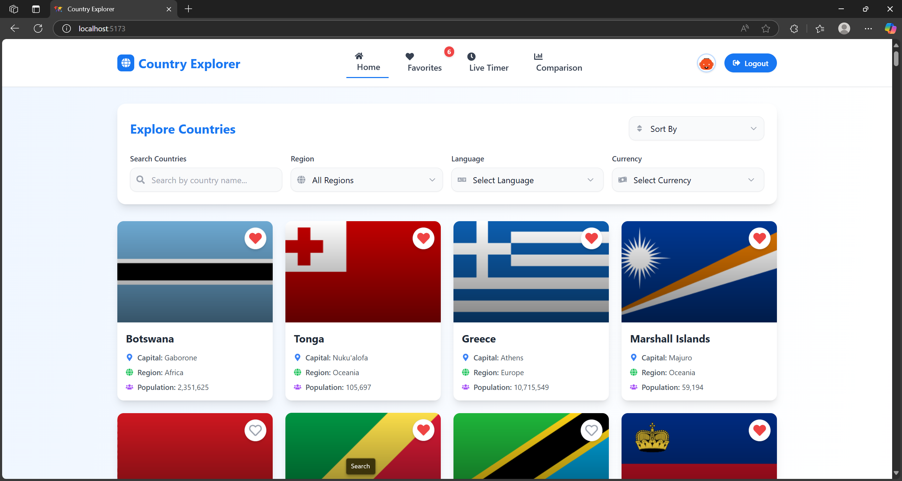

[](https://classroom.github.com/a/mNaxAqQD)

# Country Explorer

A modern, interactive web application for exploring and comparing countries around the world. Built with React, Vite, and the REST Countries API, this application provides a rich user experience for discovering country information, comparing statistics, and visualizing data.



## Table of Contents
- [Features](#features)
- [Tech Stack](#tech-stack)
- [Prerequisites](#prerequisites)
- [Installation](#installation)
- [Development](#development)
- [Building for Production](#building-for-production)
- [API Documentation](#api-documentation)
- [Testing](#testing)
- [Deployment](#deployment)
- [Contributing](#contributing)
- [License](#license)

## Features

### Core Features
- **Country Browsing**: Explore all countries with pagination
- **Advanced Search**: Real-time search by country name or code
- **Multiple Filters**: Filter by region, currency, and language
- **Country Comparison**: Compare multiple countries with interactive charts
- **Detailed Statistics**: View population and area comparisons
- **Quick Selection**: One-click selection of popular countries
- **Live Timer**: Real-time countdown timer for tracking time spent on the application

### Technical Features
- **Responsive Design**: Mobile-first approach with Tailwind CSS
- **Modern UI**: Beautiful gradients and smooth animations
- **Performance Optimized**: Lazy loading and virtualized lists
- **Accessibility**: ARIA labels and keyboard navigation
- **Error Handling**: Comprehensive error boundaries and fallbacks

## Tech Stack

### Frontend
- **React 18.2.0**: UI library
- **Vite 5.1.6**: Build tool and development server
- **Tailwind CSS 3.4.1**: Utility-first CSS framework
- **Framer Motion 12.7.4**: Animation library
- **Chart.js 4.4.1**: Data visualization
- **React Chart.js 5.2.0**: React wrapper for Chart.js

### Development Tools
- **Jest 29.7.0**: Testing framework
- **ESLint 8.57.0**: Code linting
- **PostCSS 8.4.35**: CSS processing
- **Testing Library**: Component testing

## Prerequisites

Before you begin, ensure you have the following installed:
- Node.js (v16 or higher)
- npm (v7 or higher)
- Git

## Installation

1. Clone the repository:
```bash
git clone https://github.com/SE1020-IT2070-OOP-DSA-25/af-2-LasMinruk.git
cd af-2-LasMinruk
```

2. Install dependencies:
```bash
npm install
```

## Development

1. Start the development server:
```bash
npm run dev
```

The application will be available at `http://localhost:5173`

2. Development features:
- Hot Module Replacement (HMR)
- ESLint integration
- Source maps for debugging
- Development-specific environment variables

## Building for Production

1. Create a production build:
```bash
npm run build
```

2. Preview the production build:
```bash
npm run preview
```

The build process includes:
- Code splitting
- Tree shaking
- Minification
- Asset optimization
- Source maps generation
- Environment variable injection

## API Documentation

### REST Countries API Integration

The application uses the REST Countries API (v3.1) for all country data. Here are the available endpoints:

#### Base Endpoints
- `GET /v3.1/all` - Fetch all countries
- `GET /v3.1/name/{name}` - Search by country name
- `GET /v3.1/name/${encodeURIComponent(search.trim())}` - URL-encoded search
- `GET /v3.1/region/{region}` - Filter by region
- `GET /v3.1/currency/{currency}` - Filter by currency
- `GET /v3.1/lang/{language}` - Filter by language
- `GET /v3.1/alpha/{code}` - Get country by code
- `GET /v3.1/alpha?codes={code1},{code2}` - Get multiple countries

#### Example Usage

1. **Searching Countries**
```javascript
const searchCountries = (searchTerm) => {
  const encodedSearch = encodeURIComponent(searchTerm.trim());
  fetch(`https://restcountries.com/v3.1/name/${encodedSearch}`)
    .then(response => response.json())
    .then(data => {
      // Process search results
    })
    .catch(error => {
      console.error('Error searching countries:', error);
    });
};
```

2. **Filtering by Currency**
```javascript
const filterByCurrency = (currencyCode) => {
  fetch(`https://restcountries.com/v3.1/currency/${currencyCode}`)
    .then(response => response.json())
    .then(data => {
      // Process currency filter results
    });
};
```

3. **Filtering by Language**
```javascript
const filterByLanguage = (languageCode) => {
  fetch(`https://restcountries.com/v3.1/lang/${languageCode}`)
    .then(response => response.json())
    .then(data => {
      // Process language filter results
    });
};
```

### API Response Structure
```json
{
  "name": {
    "common": "Country Name",
    "official": "Official Country Name"
  },
  "cca3": "Country Code",
  "population": 123456789,
  "area": 123456,
  "region": "Region Name",
  "capital": ["Capital City"],
  "flags": {
    "svg": "flag-url",
    "alt": "flag description"
  },
  "languages": {
    "eng": "English"
  },
  "currencies": {
    "USD": {
      "name": "US Dollar",
      "symbol": "$"
    }
  }
}
```


## Testing

Run the test suite:
```bash
npm run test
```

The test suite covers:
- Component rendering
- User interactions
- API integration
- Error handling
- Chart functionality
- Country comparison features

### Test Structure
```javascript
describe('CountryCard', () => {
  it('renders country information correctly', () => {
    // Test implementation
  });

  it('handles missing data gracefully', () => {
    // Test implementation
  });
});
```

## Deployment

The application is deployed on Vercel:
- **Live Demo**: [https://country-explorer-delta-ten.vercel.app/](https://country-explorer-delta-ten.vercel.app/)

### Deployment Process
1. Build the application
2. Configure environment variables
3. Deploy to Vercel
4. Set up custom domain (optional)

## Contributing

1. Fork the repository
2. Create your feature branch (`git checkout -b feature/amazing-feature`)
3. Commit your changes (`git commit -m 'Add some amazing feature'`)
4. Push to the branch (`git push origin feature/amazing-feature`)
5. Open a Pull Request

## License

This project is licensed under the MIT License - see the [LICENSE](LICENSE) file for details.

---

Made with dedication by Lasiru
